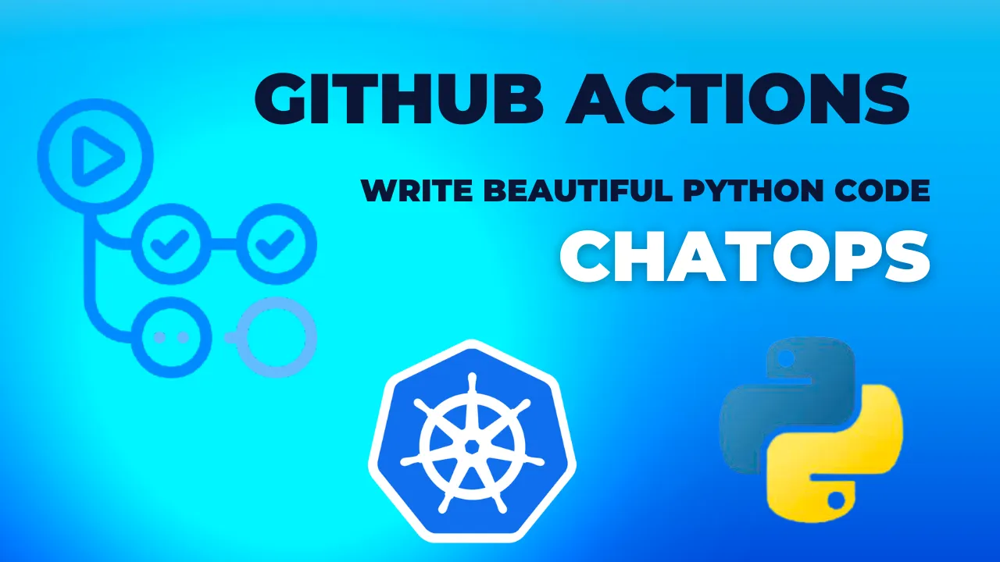
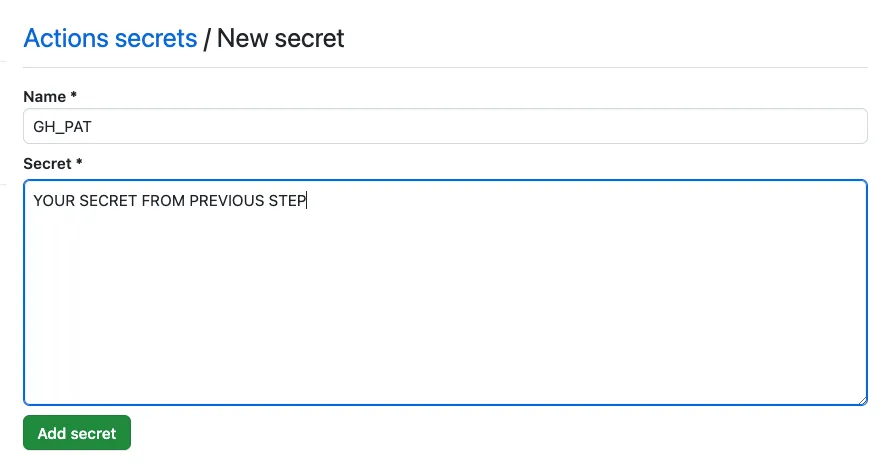
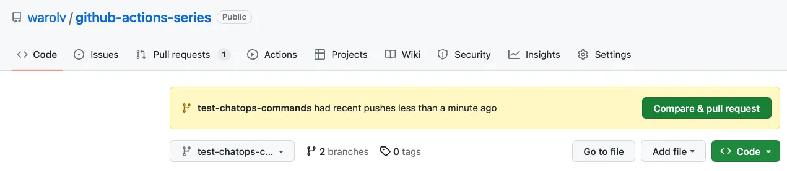
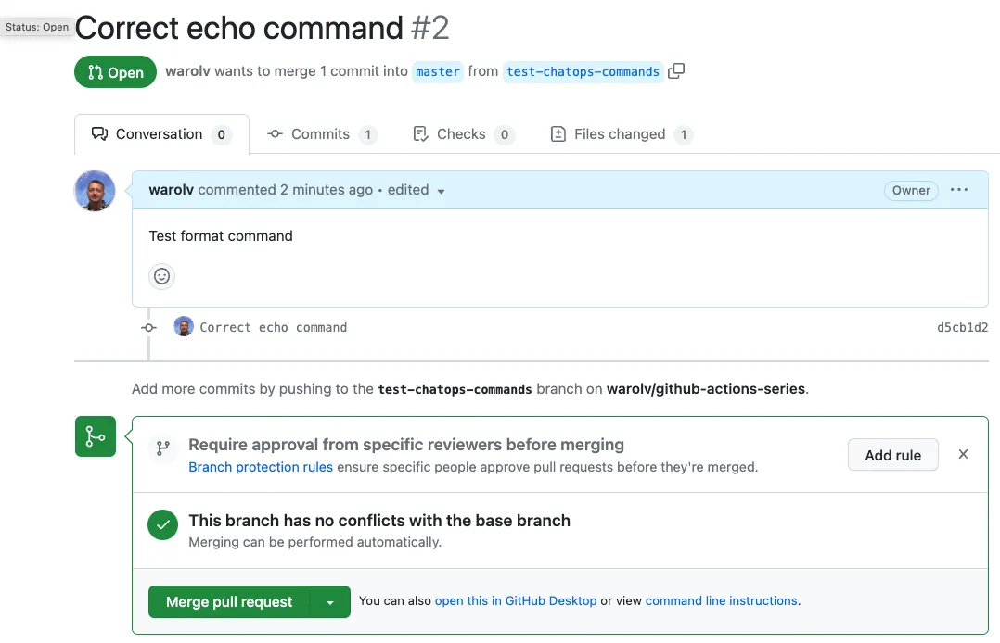
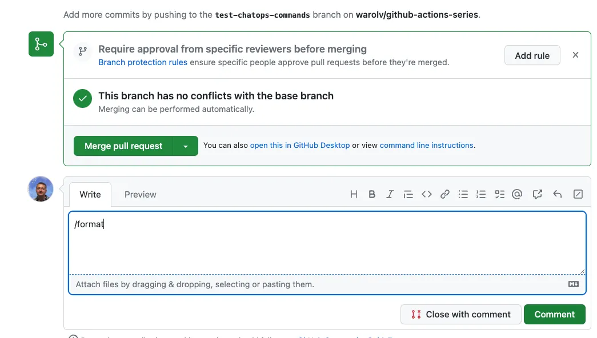
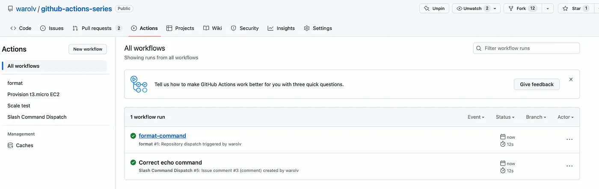
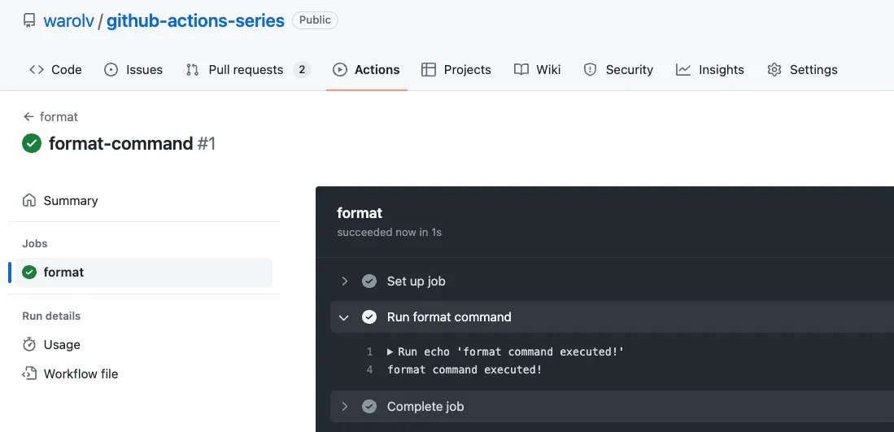
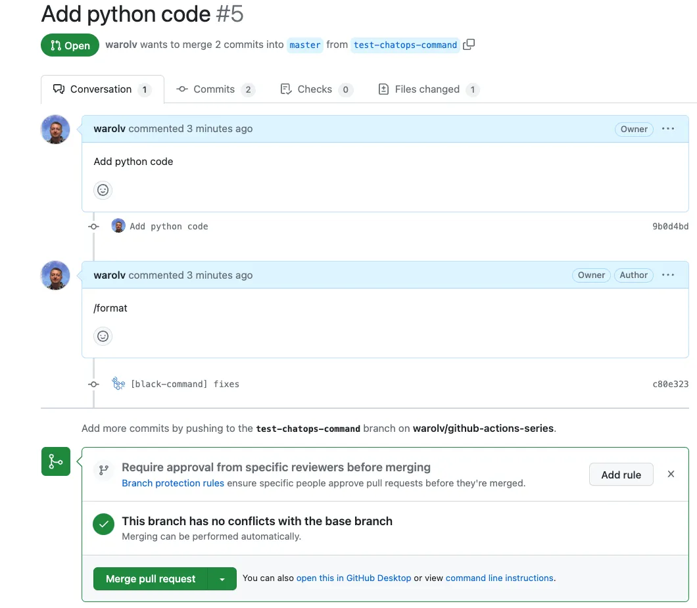
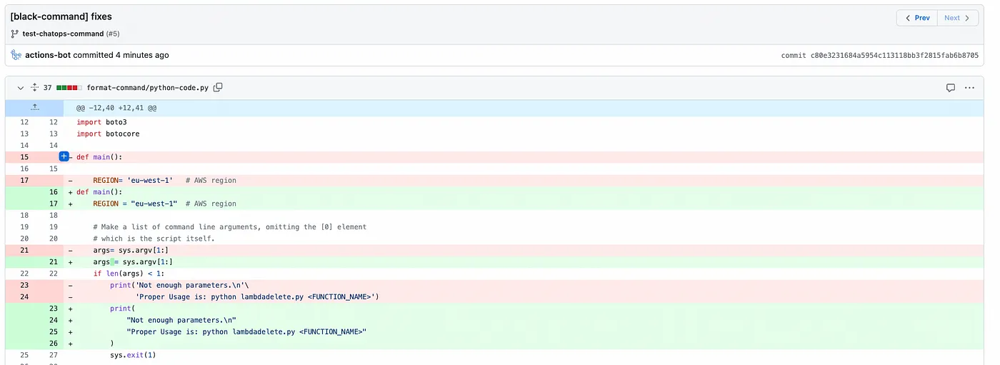
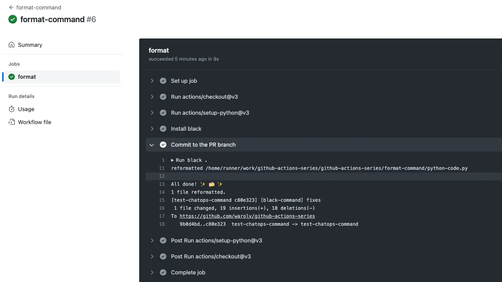

# Github Actions with ChatOps to write Beautiful Python Code



**In this tutorial, I will show how to:**


1. Trigger Github Actions Workflow using PR comments like ‘/format’ (ChatOps). I will use 'slash-command-dispatch' for this.


2. Format the python code with PEP8 as part of PR and re-commit it again.


### Github Actions published guides:

1. [Use GitHub Actions and Terraform to provision EC2 instance](tf-example.md)

2. [GitOps way with Github Actions and self-hosted runner on Kubernetes](gitops-selfhosted-runner.md)

3. [Automatic scaling with Github Actions and self-hosted runners](scale-runners.md)

4. [Github Actions with k8s and Karpenter to dynamically provision your runners on spot instances](gh-karpenter-spots.md)

5. [Github Actions with ChatOps to write beautiful python code](gh-chatops.md)

6. [OpenID Connect and Github Actions to authenticate with Amazon Web Services](gh-oidc.md)

## Let's start

I will start from the first part.

> "Trigger Github Actions Workflow using PR comments like ‘/format’ (ChatOps). I will use slash-command-dispatch for this."


Why create dispatch events?

> "ChatOps with slash commands can work in a basic way by parsing the commands during issue_comment events and immediately processing the command. In repositories with a lot of activity, the workflow queue will get backed up very quickly trying to handle new issue_comment events and process the commands themselves.
Dispatching commands to be processed elsewhere keeps the workflow queue moving quickly. It essentially enables parallel processing of workflows.
An additional benefit of dispatching is that it allows non-sensitive workloads to be run in public repositories to save using private repository GitHub Action minutes."

Read more: https://github.com/peter-evans/slash-command-dispatch

**Adding 'Slash Command Dispatch' workflow.**

> ".github/workflows/sh-dispatcher.yaml"


```yaml
name: Slash Command Dispatch
on:
  issue_comment:
    types: [created]
jobs:
  slashCommandDispatch:
    runs-on: ubuntu-latest
    steps:
      - name: Slash Command Dispatch
        uses: peter-evans/slash-command-dispatch@v3
        with:
          token: ${{ secrets.GH_PAT }}
          commands: |
            format
          reactions: eyes
```

For ‘Slash Command Dispatch’ I used ‘secrets.GH_PAT’, I explained in previous posts: https://github.com/warolv/github-actions-series/blob/master/scale-runners.md how to generate PAT, please read it.

After PAT generated, need to add it as a secret (GH_PAT) of your GitHub repo.

Go to repo’s settings -> ‘Secrets and variables’ -> ‘actions’ -> ‘New repository secret’.



And the command itself:

> ".github/workflows/format-command.yml"

```yaml
name: format
on:
  repository_dispatch:
    types: [format-command]
jobs:
  format:
    runs-on: ubuntu-latest
    steps:
      - name: Run format command
        run: |
          echo 'format command executed!'
```

## Verifying ‘format’ command is executed on PR’s comment

I will verify first that ‘/format’ command triggered on PR’s comments and ‘format command executed!’ being seen in the console.


For verification need to create the PR, in my example:

```sh
git checkout -b test-chatops-commands
```

**Do some change**, I changed output for echo in my case,

from ‘echo ‘format command executed!’’ to ‘echo ‘Format command executed!’’

```sh
git commit -am “Push changes”
```

**Open PR:**




**Now add comment ‘/format’.**








You can see ‘format command executed!’ , so it works :-) !

Next step will be to use ‘black’ tool for the command.

You can find example of usage [here](https://github.com/peter-evans/slash-command-dispatch/blob/main/docs/examples.md#black)


## Using ‘black’ to format python code

https://pypi.org/project/black/


> "Black is the uncompromising Python code formatter. By using it, you agree to cede control over minutiae of hand-formatting. In return, Black gives you speed, determinism, and freedom from pycodestyle nagging about formatting. You will save time and mental energy for more important matters."


To use ‘black’ I will rewrite command workflow:

> ".github/workflows/format-command.yaml"


```yaml
name: format-command
on:
  repository_dispatch:
    types: [format-command]
jobs:
  format:
    runs-on: ubuntu-latest
    steps:
      # Checkout the pull request branch
      - uses: actions/checkout@v3
        with:
          token: ${{ secrets.GH_PAT }}
          repository: ${{ github.event.client_payload.pull_request.head.repo.full_name }}
          ref: ${{ github.event.client_payload.pull_request.head.ref }}

      # Setup Python environment
      - uses: actions/setup-python@v3

      # Install black
      - name: Install black
        run: pip install black

      # Execute black and commit the change to the PR branch
      - name: Commit to the PR branch
        run: |
          black .
          git config --global user.name 'actions-bot'
          git config --global user.email '58130806+actions-bot@users.noreply.github.com'
          git commit -am "[black-command] fixes"
          git push
```

Now I will create another PR to test ‘/format’ workflow.

As part of PR I added python code to test ‘black’ with this code:

```python
#!/usr/bin/python
# -*- coding: utf-8 -*-
# lambdadelete.py
# It is an example that handles Lambda functions on AWS.
# It uses Client API (low-level) of Boto3.
# Delete a Lambda function.
# You must provide 1 parameter:
# FUNCTION_NAME      = Lambda function name


import sys
import boto3
import botocore

def main():

    REGION= 'eu-west-1'   # AWS region

    # Make a list of command line arguments, omitting the [0] element
    # which is the script itself.
    args= sys.argv[1:]
    if len(args) < 1:
        print('Not enough parameters.\n'\
              'Proper Usage is: python lambdadelete.py <FUNCTION_NAME>')
        sys.exit(1)

    function_name= args[0]
    print('Lambda function name: ' + function_name)

    # Create a Lambda Client
    lambda_client = boto3.client('lambda', region_name=REGION)

    # Delete Lambda function
    try:
        print('Deleting function ...')

        response= lambda_client.delete_function(
                            FunctionName=function_name)
        print('Response:')
        print(response)
        print('\nDeleted')

    except botocore.exceptions.ClientError as e:
        if e.response['Error']['Code'] == "ResourceNotFoundException":
            print("Error: Function Not Found!!")
        elif e.response['Error']['Code'] == "AccessDeniedException":
            print("Error: Access Denied!!")
        elif e.response['Error']['Code'] == "ValidationException":
            print("Error: Name Not Valid!!")
        else:
            raise

    return


# This is the standard boilerplate that calls the main() function.
if __name__ == '__main__':
    main()
```



You can see above new commit was pushed to this PR.





It working great as you can see:-)

You can find all the code | workflows and python example code in my repo:

```sh
git@github.com:warolv/github-actions-series.git
cd format-command
```

Thank you for reading, I hope you enjoyed it.

I also will create Youtube video for this tutorial on my YT channel: https://www.youtube.com/@igorzhivilo, please subscribe!

