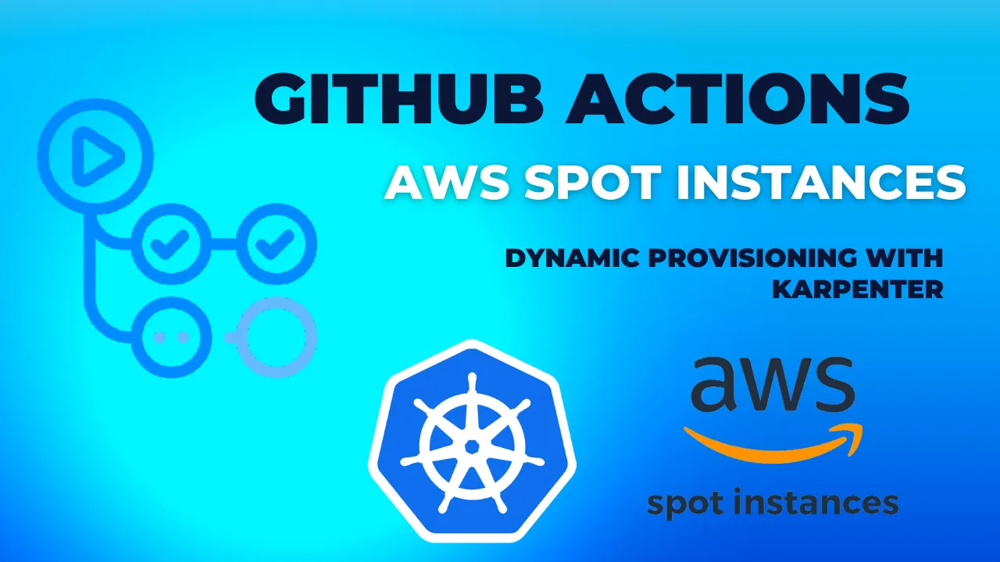
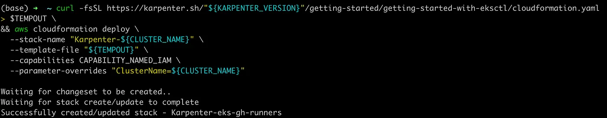
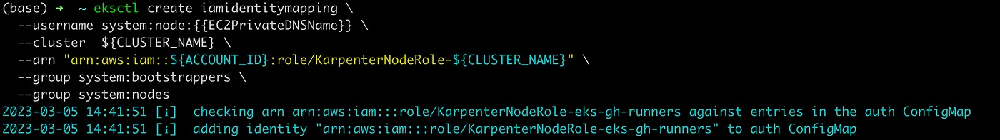
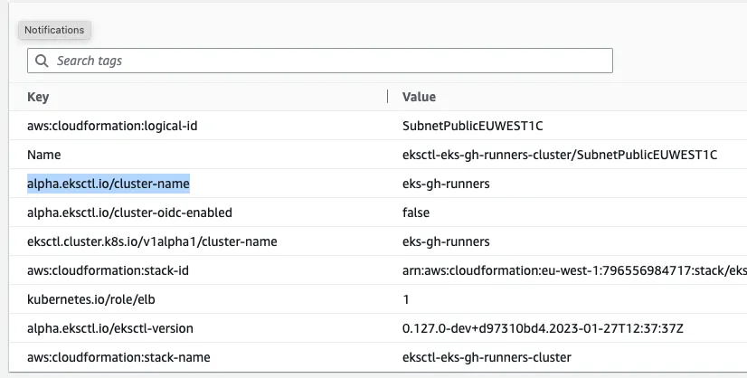
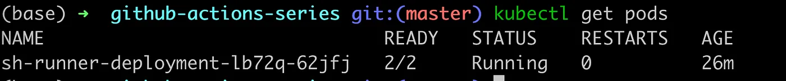
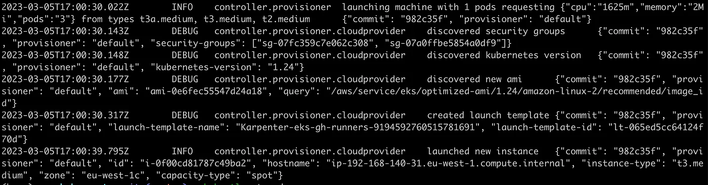
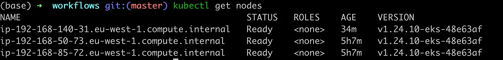
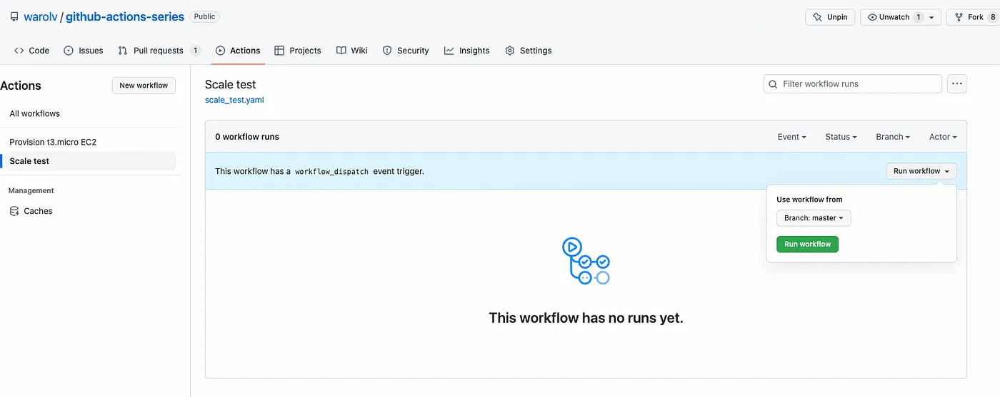
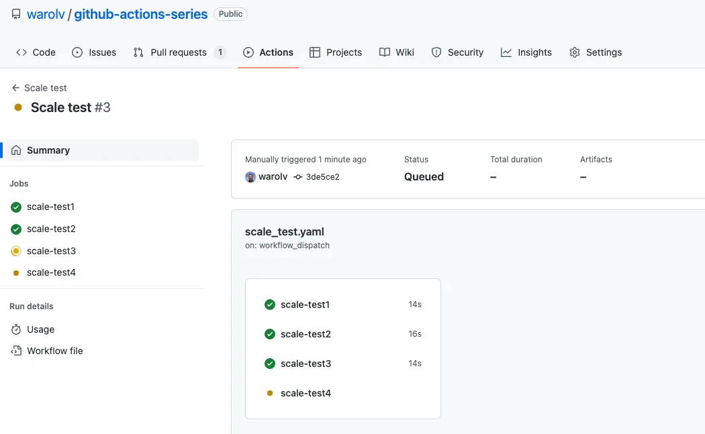

# Github Actions with k8s and Karpenter to dynamically provision your runners on spot instances



The main purpose of this guide is to show you how to build CI with Github Actions which is not limited by capacity (resource) and able to run multiple CI workflows in parallel.

In this tutorial, I will show how to:

1. Run self-hosted runners with Github Actions on AWS spot instances.

2. Dynamically add/remove resources to your k8s cluster by Karpenter.

> "This guide is continuation of previous tutorial, please make sure you read it and have cluster with installed ARC."

### Github Actions published guides:

1. [Use GitHub Actions and Terraform to provision EC2 instance](tf-example.md)

2. [GitOps way with Github Actions and self-hosted runner on Kubernetes](gitops-selfhosted-runner.md)

3. [Automatic scaling with Github Actions and self-hosted runners](scale-runners.md)

4. [Github Actions with k8s and Karpenter to dynamically provision your runners on spot instances](gh-karpenter-spots.md)

5. [Github Actions with ChatOps to write beautiful python code](gh-chatops.md)

6. [OpenID Connect and Github Actions to authenticate with Amazon Web Services](gh-oidc.md)

## What is Karpenter?

https://karpenter.sh/

Karpenter automatically launches just the right compute resources to handle your cluster’s applications. It is designed to let you take full advantage of the cloud with fast and simple compute provisioning for Kubernetes clusters.


## Let’s do it

I will use EKS cluster for demo

Prerequisites

* AWS account with all needed permissions to create EKS cluster
* Installed kubectl and eksctl
* Installed AWS CLI

### Provision of EKS cluster
You can do it by Terraform or using eksctl, to make it simple I will use eksctl

### Let’s provision the EKS cluster
https://docs.aws.amazon.com/eks/latest/userguide/create-cluster.html

Provision of EKS cluster to the ‘eu-west-1’ region, cluster name: eks-gh-runners

```bash
$ eksctl create cluster \
 --name eks-gh-runners \
 --region eu-west-1
```

## Install Cert Manager and ARC to EKS

Read my previous post for detailed explanation: https://warolv.medium.com/automatic-scaling-with-github-actions-and-self-hosted-runners-16790abd02da

1. You need to Generate PAT

2. Install Cert Manager

```bash
helm repo add jetstack https://charts.jetstack.io
helm repo update

kubectl apply -f https://github.com/cert-manager/cert-manager/releases/download/v1.11.0/cert-manager.crds.yaml

helm install \
  cert-manager jetstack/cert-manager \
  --namespace cert-manager \
  --create-namespace \
  --version v1.11.0 
```

3. Create k8s secret for ARC from Github’s Personal access token

```bash
kubectl create ns actions-runner-system
kubectl create secret generic controller-manager \
    -n actions-runner-system \
    --from-literal=github_token=${GITHUB_TOKEN} 
```

4. Install ARC

```bash
helm repo add actions-runner-controller https://actions-runner-controller.github.io/actions-runner-controller
helm upgrade --install --namespace actions-runner-system --create-namespace \
             --wait actions-runner-controller actions-runner-controller/actions-runner-controller
```

> "Read my previous post for detailed explanation: https://warolv.medium.com/automatic-scaling-with-github-actions-and-self-hosted-runners-16790abd02da"

### Install Karpenter to EKS
https://archive.eksworkshop.com/beginner/085_scaling_karpenter/setup_the_environment/

Set the following environment variable to the Karpenter version you would like to install.

```bash
export CLUSTER_NAME=eks-gh-runners
export KARPENTER_VERSION=v0.20.0
export CLUSTER_ENDPOINT="$(aws eks describe-cluster --name ${CLUSTER_NAME} --query "cluster.endpoint" --output text)"
export ACCOUNT_ID=$(aws sts get-caller-identity --query 'Account' --output text)
export TEMPOUT=$(mktemp)
```

Create the ‘KarpenterNode’ IAM Role

```bash
curl -fsSL https://karpenter.sh/"${KARPENTER_VERSION}"/getting-started/getting-started-with-eksctl/cloudformation.yaml  > $TEMPOUT \
&& aws cloudformation deploy \
  --stack-name "Karpenter-${CLUSTER_NAME}" \
  --template-file "${TEMPOUT}" \
  --capabilities CAPABILITY_NAMED_IAM \
  --parameter-overrides "ClusterName=${CLUSTER_NAME}"
```



### Grant access to instances using the profile to connect to the cluster

```bash
eksctl create iamidentitymapping \
  --username system:node:{{EC2PrivateDNSName}} \
  --cluster  ${CLUSTER_NAME} \
  --arn "arn:aws:iam::${ACCOUNT_ID}:role/KarpenterNodeRole-${CLUSTER_NAME}" \
  --group system:bootstrappers \
  --group system:nodes

```



Before adding the IAM Role for the service account we need to create the IAM OIDC Identity Provider for the cluster.

```bash
eksctl utils associate-iam-oidc-provider --cluster ${CLUSTER_NAME} --approve
```

Karpenter requires permissions like launching instances. This will create an AWS IAM Role, Kubernetes service account, and associate them using IAM Roles for Service Accounts (IRSA)

```bash
eksctl create iamserviceaccount --override-existing-serviceaccounts \
  --cluster "${CLUSTER_NAME}" --name karpenter --namespace karpenter \
  --role-name "${CLUSTER_NAME}-karpenter" \
  --attach-policy-arn "arn:aws:iam::${ACCOUNT_ID}:policy/KarpenterControllerPolicy-${CLUSTER_NAME}" \
  --role-only \
  --approve
```

Create the EC2 Spot Linked Role

```bash
aws iam create-service-linked-role --aws-service-name spot.amazonaws.com 2> /dev/null || echo 'Already exist'
```

Install Karpenter Helm Chart

```bash
export CLUSTER_ENDPOINT="$(aws eks describe-cluster --name ${CLUSTER_NAME} --query "cluster.endpoint" --output text)"
helm upgrade --install --namespace karpenter --create-namespace \
  karpenter oci://public.ecr.aws/karpenter/karpenter \
  --version ${KARPENTER_VERSION} \
  --set serviceAccount.annotations."eks\.amazonaws\.com/role-arn"=${KARPENTER_IAM_ROLE_ARN} \
  --set settings.aws.clusterName=${CLUSTER_NAME} \
  --set settings.aws.clusterEndpoint=${CLUSTER_ENDPOINT} \
  --set defaultProvisioner.create=false \
  --set settings.aws.defaultInstanceProfile=KarpenterNodeInstanceProfile-${CLUSTER_NAME} \
  --set settings.aws.interruptionQueueName=${CLUSTER_NAME} \
  --wait
```


As you see everything deployed successfully! :-)

## Create and deploy Karpenter’s provisioner for AWS Spot Instances

### Provisioner Overview:

1. Provider will spin up nodes from security group and subnet with ‘alpha.eksctl.io/cluster-name: eks-gh-runners’ tag, check you have those tags.


2. Spots will be provisioned from ‘medium’ type and ‘amd64’ architecture.

3. Node will have ‘instance-type: spot-ci’ label, which I am using with ‘nodeSelector’ for runners, in order to deploy them only to spots provisioned with Karpenter.

```bash
apiVersion: karpenter.sh/v1alpha5
kind: Provisioner
metadata:
  name: default
spec:
  labels:
    instance-type: spot-ci
  limits:
    resources:
      cpu: 1k
  provider:
    securityGroupSelector:
      alpha.eksctl.io/cluster-name: eks-gh-runners
    subnetSelector:
      alpha.eksctl.io/cluster-name: eks-gh-runners
    tags:
      alpha.eksctl.io/cluster-name: eks-gh-runners
  requirements:
  - key: node.kubernetes.io/instance-type
    operator: In
    values: ["t2.medium", "t3.medium", "t3a.medium"]
  - key: karpenter.sh/capacity-type
    operator: In
    values:
    - spot
  - key: kubernetes.io/arch
    operator: In
    values:
    - amd64
  ttlSecondsAfterEmpty: 30
```

```bash
git clone git@github.com:warolv/github-actions-series.git
cd gh-karpenter
kubectl apply -f hra.yaml
```

### Deploying self-hosted runners with HRA
Read my previous post for detailed explanation of HRA: https://warolv.medium.com/automatic-scaling-with-github-actions-and-self-hosted-runners-16790abd02da

In order for scaling test to work, need to tune runner’s requests first.

I want to **run one self-hosted runner per worker node.**

Karpenter will provision spots of medium type with 2 CPU and 4Gb of memory only, meaning I need to set CPU requests of runner’s pod more than 1 and less than 2 CPU, let’s pick 1.5 CPU to run a runner per worker node.

I have only 2 worker nodes, this way Karpenter need to provision additional capacity for runners.

As you see I changes requests to 1.5 CPU and 3Gb.

hra.yaml

```yaml
apiVersion: actions.summerwind.dev/v1alpha1
kind: RunnerDeployment
metadata:
  name: sh-runner-deployment
spec:
  template:
    spec:
      repository: warolv/github-actions-series
      labels:
      - sh-k8s-runner
      resources:
        requests:
          cpu: 1.5
          memory: 3Gb
      nodeSelector: 
        instance-type: spot-ci
---
apiVersion: actions.summerwind.dev/v1alpha1
kind: HorizontalRunnerAutoscaler
metadata:
  name: sh-runner-deployment-autoscaler
spec:
  scaleTargetRef:
    kind: RunnerDeployment
    name: sh-runner-deployment
  minReplicas: 1
  maxReplicas: 4
  metrics:
  - type: TotalNumberOfQueuedAndInProgressWorkflowRuns
    repositoryNames:
    - warolv/github-actions-series
```

```bash
git clone git@github.com:warolv/github-actions-series.git
cd gh-karpenter
kubectl apply -f hra.yaml
```



Runner will be deployed on spot provisioned with Karpenter only, if configuration is ok, you will see in logs:

> "kubectl logs karpenter-bd845d99-lr7n4 -n karpenter"





## Testing dynamic provisioning of new resources with scale test

For testing purposes will be used scale test from previous guide:

https://raw.githubusercontent.com/warolv/github-actions-series/master/.github/workflows/scale_test.yaml

```yaml
name: Scale test

on:
  workflow_dispatch:

jobs:
  scale-test1:
    runs-on: sh-k8s-runner
    steps:
      - uses: actions/checkout@v3
      - uses: actions/setup-node@v3
        with:
          node-version: '14'
      - run: npm install -g bats
      - run: bats -v
      - run: sudo apt update -y
      - name: Run a one-line script
        run: echo scale test 1 finished!
  scale-test2:
    runs-on: sh-k8s-runner
    steps:
      - uses: actions/checkout@v3
      - uses: actions/setup-node@v3
        with:
          node-version: '14'
      - run: npm install -g bats
      - run: bats -v
      - run: sudo apt update -y
      - name: Run a one-line script
        run: echo scale test 2 finished!
  scale-test3:
    runs-on: sh-k8s-runner
    steps:
      - uses: actions/checkout@v3
      - uses: actions/setup-node@v3
        with:
          node-version: '14'
      - run: npm install -g bats
      - run: bats -v
      - run: sudo apt update -y
      - name: Run a one-line script
        run: echo scale test 3 finished!
  scale-test4:
    runs-on: sh-k8s-runner
    steps:
      - uses: actions/checkout@v3
      - uses: actions/setup-node@v3
        with:
          node-version: '14'
      - run: npm install -g bats
      - run: bats -v
      - run: sudo apt update -y
      - name: Run a one-line script
        run: echo scale test 4 finished!git clone git@github.com:warolv/github-actions-series.git
cd .github/workflows
kubectl apply -f hra.yaml
```

You must push this workflow to your repo, to ‘.github/workflows’ folder.

### It’s time to run Scale Test

Before you executed ‘scale test’, you have 3 nodes, 2 provisioned on EKS with eksctl, when the cluster is created.

3rd node provisioned with Karpenter to run first runner.









After some time, around 1 min you can see additional capacity is provisioned by Karpenter :-)

After workflow is finished, worker nodes under Karpenter’s management will be removed.

Works!

Thank you for reading, I hope you enjoyed it, see you in the next post.


I also will create Youtube video for this tutorial on my YT channel: https://www.youtube.com/@igorzhivilo, please subscribe!

If you want to be notified when the next post of this tutorial is published, please follow me on [medium](https://warolv.medium.com/) and on my Twitter (@warolv).

You can get all tutorials of Gihub Action from my github repo by cloning it: ‘git clone https://github.com/warolv/github-actions-series.git‘
