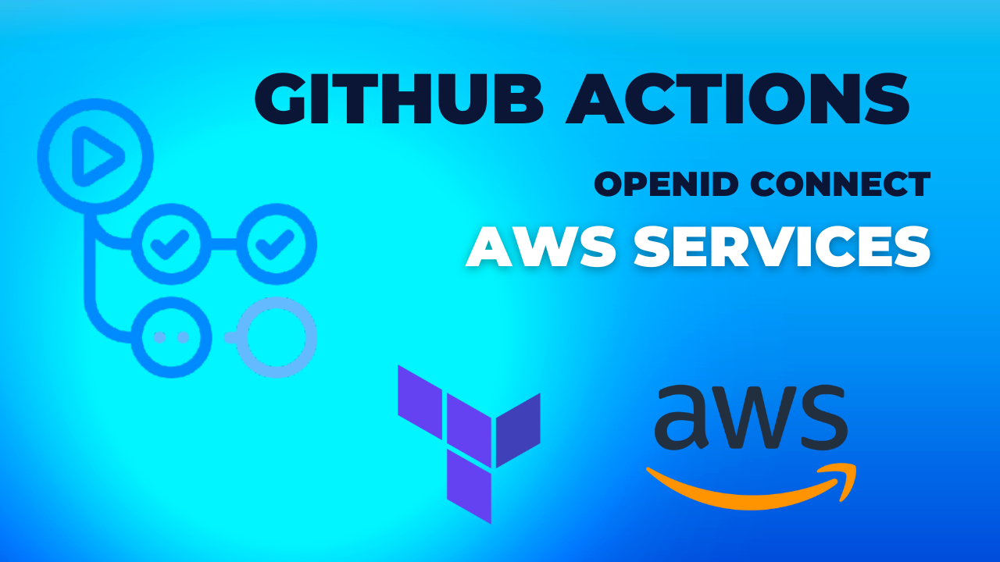
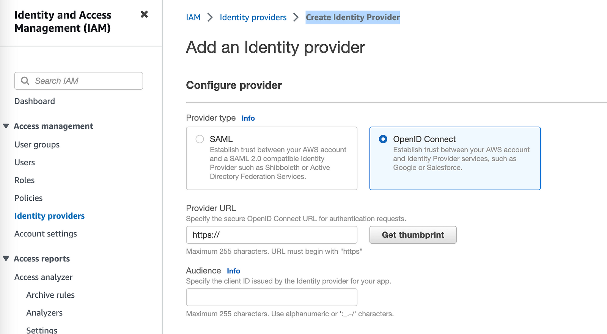
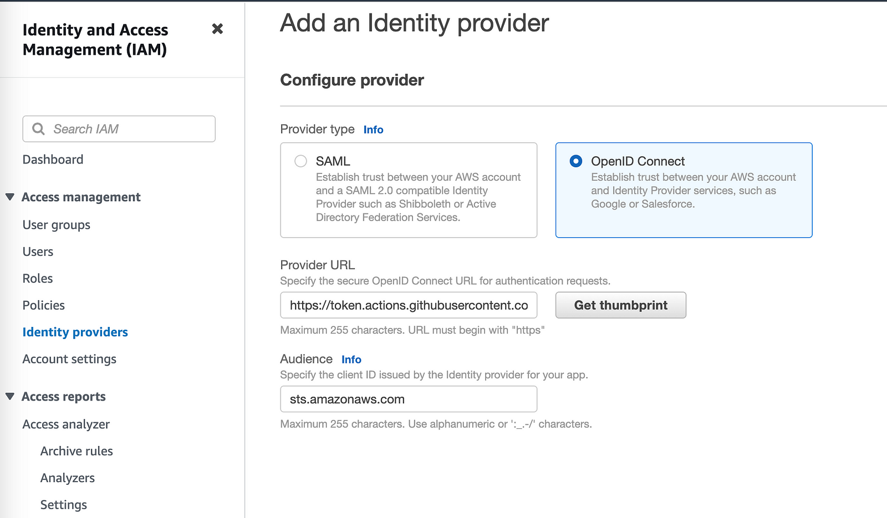
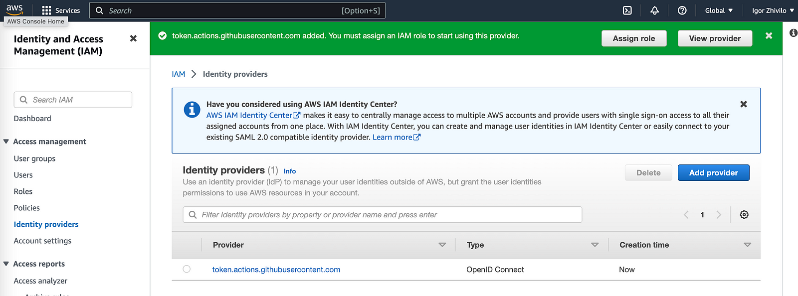
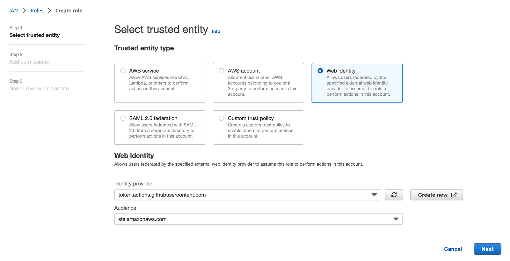
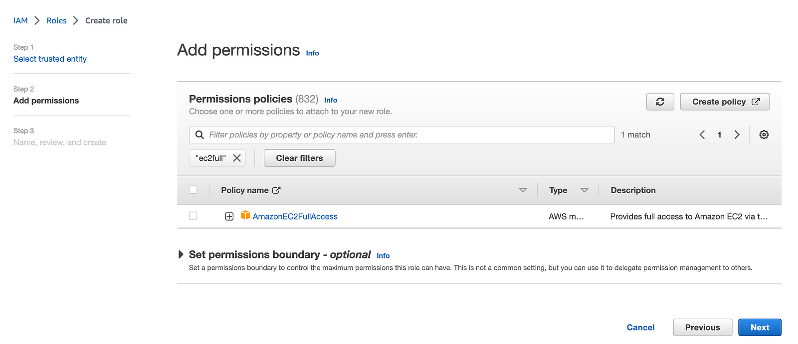

# Use OpenID Connect with Github Actions to authenticate with Amazon Web Services.



**In this tutorial, I will show how to:**


1. Use OpenID Connect within your Github workflows to authenticate with Amazon Web Services.

> "The reason behind that is security: Avoid storing long living AWS credentials (access_key_id and secret_access_key) in Github as a secrets."

2. Improve the security of 'EC2 provisioning' workflow I described in [first guide](tf-example.md)


### Github Actions published guides:

1. [Use GitHub Actions and Terraform to provision EC2 instance](tf-example.md)

2. [GitOps way with Github Actions and self-hosted runner on Kubernetes](gitops-selfhosted-runner.md)

3. [Automatic scaling with Github Actions and self-hosted runners](scale-runners.md)

4. [Github Actions with k8s and Karpenter to dynamically provision your runners on spot instances](gh-karpenter-spots.md)

5. [Github Actions with ChatOps to write beautiful python code](gh-chatops.md)

6. [Use OpenID Connect with Github Actions to authenticate with Amazon Web Services](gh-oidc.md)


## Let's start

In previous [post](tf-example.md), I used 'configure-aws-credentials' action in workflow to authenticate via AWS.

https://github.com/aws-actions/configure-aws-credentials

```yaml
- name: Configure AWS credentials
   uses: aws-actions/configure-aws-credentials@v1
   with:
     aws-access-key-id: '${{ secrets.TF_USER_AWS_KEY }}'
     aws-secret-access-key: '${{ secrets.TF_USER_AWS_SECRET }}'
     aws-region: us-east-2
```

**But we can do better**, following the best practices and security considerations and not storing security credentials for AWS authentication in your repository.

To make it possible need to configure first OIDC provider in your AWS account and use 'role-to-assume' method with 'configure-aws-credentials' action.

Using 'configure-aws-credentials' with OIDC provider, will look like that:


```yaml
- name: Configure AWS Credentials
  uses: aws-actions/configure-aws-credentials@v2
  with:
    role-to-assume: arn:aws:iam::123456789100:role/my-github-actions-role
    aws-region: us-east-2
```

## I will start by setting up AWS OpenID Connect Identity Provider

Explanation of how to configure OpenID Connect in Amazon Web Services you can find [here](https://docs.github.com/en/actions/deployment/security-hardening-your-deployments/configuring-openid-connect-in-amazon-web-services)

Your AWS account -> IAM -> Identity providers -> Create Identity Provider. Select OpenID connect.




For the provider URL: Use 'https://token.actions.githubusercontent.com'

For the "Audience": Use 'sts.amazonaws.com'





Click on 'Get thumbprint' and then 'Add provider' button.




**Next we need to create IAM role to start using provider**

IAM -> Roles -> Create role

Select 'Web Identity'

Identity provider: 'token.actions.githubusercontent.com'

Audience: 'sts.amazonaws.com'





Click 'Next' and add needed permissions, I will use AmazonEC2FullAccess needed to provision EC2 instance.




Click 'Next'

Give your role a name: 'gh-role' in my case

Trusted policy auto generated for you, account name I changed to 12345678, but you will see you account instead.


```json
{
    "Version": "2012-10-17",
    "Statement": [
        {
            "Effect": "Allow",
            "Action": "sts:AssumeRoleWithWebIdentity",
            "Principal": {
                "Federated": "arn:aws:iam::12345678:oidc-provider/token.actions.githubusercontent.com"
            },
            "Condition": {
                "StringEquals": {
                    "token.actions.githubusercontent.com:aud": [
                        "sts.amazonaws.com"
                    ]
                }
            }
        }
    ]
}
```

Click 'Create Role' and the role will be created.


## Use OIDC provider with EC2 provisioning workflow

The original workflow I created in [first guide](tf-example.md)


**Workflow with changes included:**

```yaml
name: Provision t3.micro EC2
on:
  workflow_dispatch:
    inputs:
      ec2-name:
        description: EC2 name
        required: true
        default: 'App Server'
        type: string
jobs:
  provision-ec2:
    runs-on: ubuntu-latest
    permissions:
      id-token: write
      contents: read
    steps:
      - uses: actions/checkout@v3
      - uses: actions/setup-node@v3
        with:
          node-version: '14'
      - name: Configure AWS credentials
        uses: aws-actions/configure-aws-credentials@v2
        with:
          role-to-assume: arn:aws:iam::12345678:role/gh-role
          aws-region: us-east-2
      - name: Setup Terraform
        uses: hashicorp/setup-terraform@v2
        with:
          terraform_wrapper: false
      - name: Terraform Apply
        id:   apply
        env:
          TF_VAR_ec2_name:  "${{ github.event.inputs.ec2-name }}"
        run: |
          cd tf-example/
          terraform init
          terraform validate
          terraform plan 
          terraform apply -auto-approve
```

1. **'Configure AWS credentials' step changed**

```yaml
- name: Configure AWS credentials
  uses: aws-actions/configure-aws-credentials@v2
  with:
    role-to-assume: arn:aws:iam::12345678:role/my-github-actions-role
    aws-region: us-east-2
```

I want to use new created OIDC provider, for this 'assume role is used'

> "Read: https://github.com/aws-actions/configure-aws-credentials for more info."

2. **Permissions section added:** you need in order to be able request the OIDC JWT ID token.

```yaml
permissions:
  id-token: write
  contents: read
```

> "Read more: https://docs.github.com/en/actions/deployment/security-hardening-your-deployments/configuring-openid-connect-in-amazon-web-services"


You can validate everything works great after changes.

You can find YAML with final workflow in github repo: https://github.com/warolv/github-actions-series/gh-oidc

```bash
git clone git@github.com:warolv/github-actions-series.git
cd gh-oidc
```

Thank you for reading, I hope you enjoyed it.

I also will create Youtube video for this tutorial on my YT channel: https://www.youtube.com/@igorzhivilo, please subscribe!
