# Automatic scaling with Github Actions and self-hosted runners

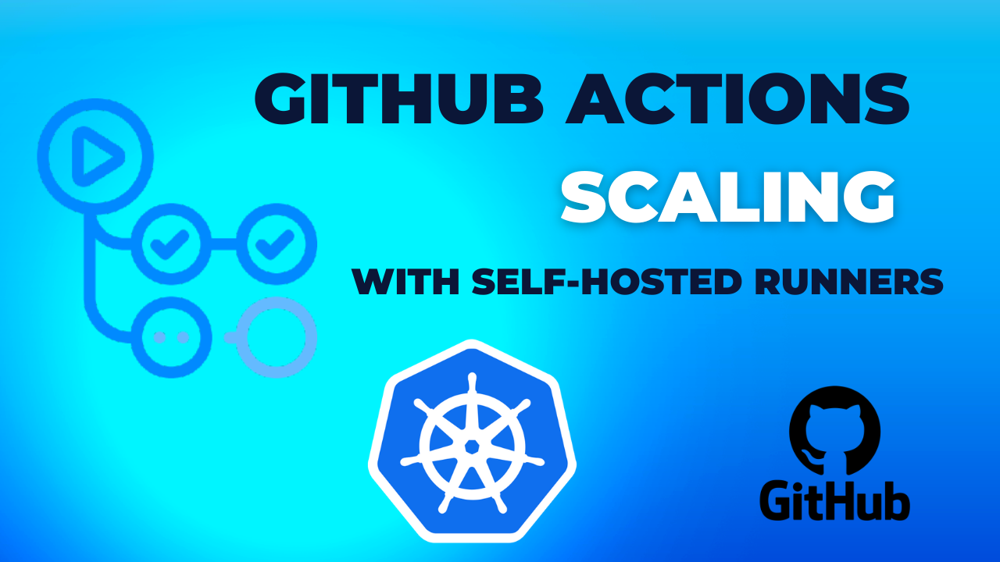

** In this tutorial, I will show how to:**


1. Deploy Actions Runner Controller (ARC) to Kubernetes and connect it with your GitHub repo.


2. Scale automatically your self-hosted runners count up to the total number of pending jobs in queue.


> "The main purpose of this guide is to describe the real use case: AWS EKS cluster which is not externally accessible, only using VPN or inside of VPC to which cluster is provisioned."

### Github Actions published guides:

1. [Use GitHub Actions and Terraform to provision EC2 instance](tf-example.md)

2. [GitOps way with Github Actions and self-hosted runner on Kubernetes](gitops-selfhosted-runner.md)

3. [Automatic scaling with Github Actions and self-hosted runners](scale-runners.md)

4. [Github Actions with k8s and Karpenter to dynamically provision your runners on spot instances](gh-karpenter-spots.md)

5. [Github Actions with ChatOps to write beautiful python code](gh-chatops.md)

6. [OpenID Connect and Github Actions to authenticate with Amazon Web Services](gh-oidc.md)

## Why to use self-hosted runner?

The reason for self-hosted runner is coming from security limitation ( in my case), I have an internal k8s cluster which is not externally reachable and can be accessed only via VPN.


**So how it works if the cluster can't be reached externally?**

> "Communication between self-hosted runners and GitHub
The self-hosted runner connects to GitHub to receive job assignments and to download new versions of the runner application. The self-hosted runner uses an HTTPS long poll that opens a connection to GitHub for 50 seconds, and if no response is received, it then times out and creates a new long poll. The application must be running on the machine to accept and run GitHub Actions jobs.
Since the self-hosted runner opens a connection to GitHub.com, you do not need to allow GitHub to make inbound connections to your self-hosted runner."


## Let's do it

The demo will be done with kind k8s cluster: https://kind.sigs.k8s.io/


To deploy self-hosted runners I will use: Actions Runner Controller (ARC)

https://github.com/actions/actions-runner-controller

## Installing ARC

By default, actions-runner-controller use cert-manager for certificate management of Admission Webhook.

### Installation of cert-manager

https://cert-manager.io/docs/installation/helm/

```bash
helm repo add jetstack https://charts.jetstack.io
helm repo update

kubectl apply -f https://github.com/cert-manager/cert-manager/releases/download/v1.11.0/cert-manager.crds.yaml

helm install \
  cert-manager jetstack/cert-manager \
  --namespace cert-manager \
  --create-namespace \
  --version v1.11.0
```

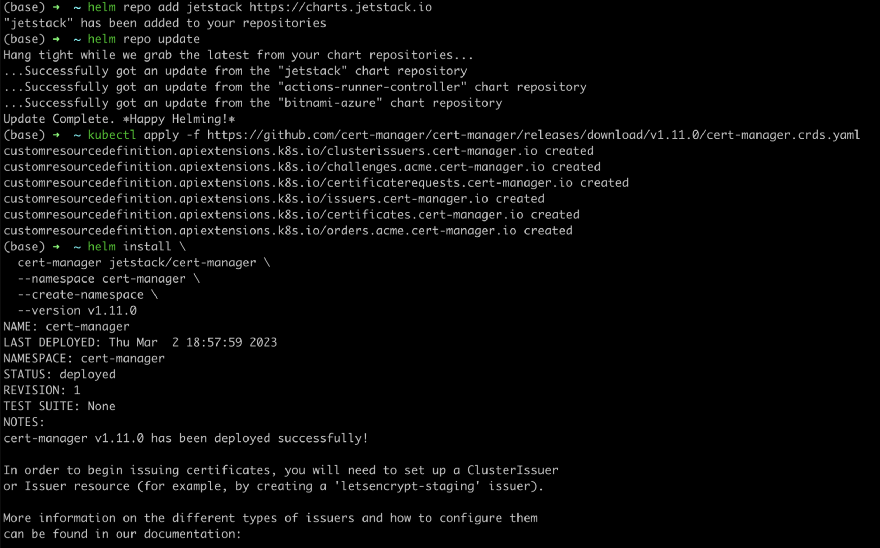


### Need to generate Github's Personal access token (PAT) first

I will use PAT authentication for Github:

https://github.com/actions/actions-runner-controller/blob/master/docs/authenticating-to-the-github-api.md

Personal Access Tokens can be used to register a self-hosted runner by actions-runner-controller.

Log-in to a GitHub account that has admin privileges for the repository, and create a personal access token with the appropriate scopes listed below:

**Required Scopes for Repository Runners**
* repo (Full control)

**Required Scopes for Organization Runners**
* repo (Full control)
* admin:org (Full control)
* admin:public_key (read:public_key)
* admin:repo_hook (read:repo_hook)
* admin:org_hook (Full control)
* notifications (Full control)
* workflow (Full control)

**Required Scopes for Enterprise Runners**
* admin:enterprise (manage_runners:enterprise)


**Go to your Github account** -> https://github.com/settings/profile, then to

Developer settings -> Generate new token

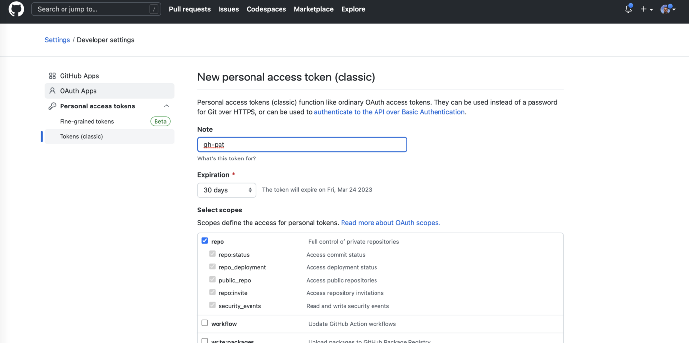

Once you have created the appropriate token, **deploy it as a secret to your Kubernetes cluster** that you are going to deploy the solution

replace GITHUB_TOKEN with one you created previously

```bash
kubectl create ns actions-runner-system
kubectl create secret generic controller-manager \
    -n actions-runner-system \
    --from-literal=github_token=${GITHUB_TOKEN}
```

### Installation of ARC


```bash
helm repo add actions-runner-controller https://actions-runner-controller.github.io/actions-runner-controller
helm upgrade --install --namespace actions-runner-system --create-namespace \
             --wait actions-runner-controller actions-runner-controller/actions-runner-controller
```


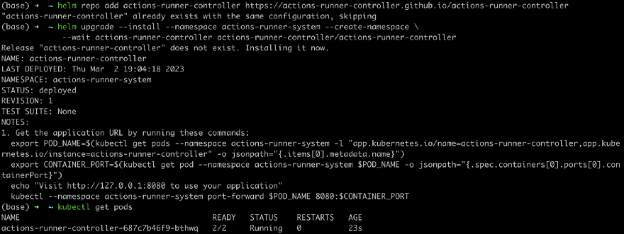


Deploying the first example runner

```bash
git clone git@github.com:warolv/github-actions-series.git
cd scale-runners
```

runner-example.yaml
```yaml
apiVersion: actions.summerwind.dev/v1alpha1
kind: RunnerDeployment
metadata:
  name: runner-example
spec:
  replicas: 1
  template:
    spec:
      repository: warolv/github-actions-series
```

```bash
kubectl apply -f runner-example.yaml
```

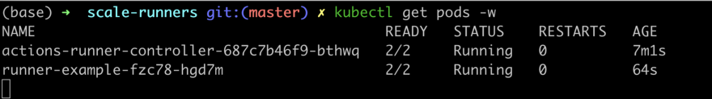


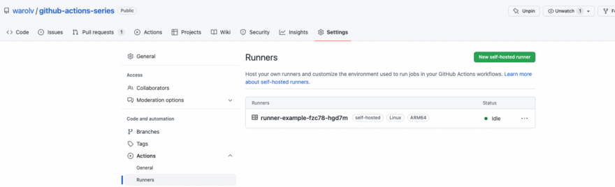


Looks very good :-), self-hosted runner is connected.

Ok, so I validated runner is deployed and connected successfully, meaning I configured everything properly.

Now it's time to remove the runner-example:

```bash
kubectl delete -f runner-example.yaml
```


## Autoscaling with HorizontalRunnerAutoscaler

https://github.com/actions/actions-runner-controller/blob/master/docs/automatically-scaling-runners.md

### Pull Driven Scaling

I will use pull driven (not webhook driven) autoscaling, because the k8s cluster in not externally accessible and webhook can't be used, no public endpoint.

> "The pull based metrics are configured in the metrics attribute of a HRA (see snippet below). The period between polls is defined by the controller's --sync-period flag. If this flag isn't provided then the controller defaults to a sync period of 1m, this can be configured in seconds or minutes.
Be aware that the shorter the sync period the quicker you will consume your rate limit budget, depending on your environment this may or may not be a risk. Consider monitoring ARCs rate limit budget when configuring this feature to find the optimal performance sync period"

### Used Metric Option

TotalNumberOfQueuedAndInProgressWorkflowRuns

> "The TotalNumberOfQueuedAndInProgressWorkflowRuns metric polls GitHub for all pending workflow runs against a given set of repositories. The metric will scale the runner count up to the total number of pending jobs at the sync time up to the maxReplicas configuration."

Let's deploy RunnerDeployment with a HorizontalRunnerAutoscaler

```yaml
apiVersion: actions.summerwind.dev/v1alpha1
kind: RunnerDeployment
metadata:
  name: sh-runner-deployment
spec:
  template:
    spec:
      repository: warolv/github-actions-series
---
apiVersion: actions.summerwind.dev/v1alpha1
kind: HorizontalRunnerAutoscaler
metadata:
  name: sh-runner-deployment-autoscaler
spec:
  scaleTargetRef:
    kind: RunnerDeployment
    name: sh-runner-deployment
  minReplicas: 1
  maxReplicas: 4
  metrics:
  - type: TotalNumberOfQueuedAndInProgressWorkflowRuns
    repositoryNames:
    - warolv/github-actions-series
```

Params to emphasize:

The min number of replicas is 1 and max is 4

Metrics used: TotalNumberOfQueuedAndInProgressWorkflowRuns

> "Meaning in case of load on queue, many jobs will be in pending state, HRA may scale runners up to 4 replicas."

```bash
kubectl apply -f hra.yaml
```


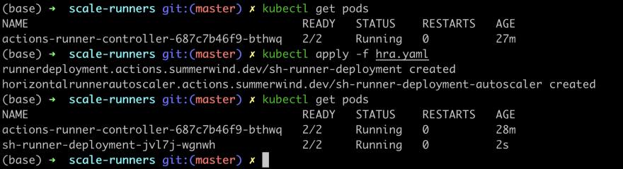


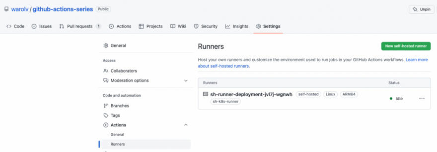


> "One runner is up, which is minimal number needed and reasonable because I still not using any runners…"

So the next step will be to create GH workflow which will use runners I deployed.

## Create GH workflow to test automatic scaling

GH workflow will be triggered manually, that why 'workflow_dispatch' event type is used.

This workflows runs 4 jobs simultaneously, main purpose was to create some load on Queue and trigger autoscaling of runners.


```yaml
name: Scale test

on:
  workflow_dispatch:

jobs:
  scale-test1:
    runs-on: sh-k8s-runner
    steps:
      - uses: actions/checkout@v3
      - uses: actions/setup-node@v3
        with:
          node-version: '14'
      - run: npm install -g bats
      - run: bats -v
      - run: sudo apt update -y
      - name: Run a one-line script
        run: echo scale test 1 finished!
  scale-test2:
    runs-on: sh-k8s-runner
    steps:
      - uses: actions/checkout@v3
      - uses: actions/setup-node@v3
        with:
          node-version: '14'
      - run: npm install -g bats
      - run: bats -v
      - run: sudo apt update -y
      - name: Run a one-line script
        run: echo scale test 2 finished!
  scale-test3:
    runs-on: sh-k8s-runner
    steps:
      - uses: actions/checkout@v3
      - uses: actions/setup-node@v3
        with:
          node-version: '14'
      - run: npm install -g bats
      - run: bats -v
      - run: sudo apt update -y
      - name: Run a one-line script
        run: echo scale test 3 finished!
  scale-test4:
    runs-on: sh-k8s-runner
    steps:
      - uses: actions/checkout@v3
      - uses: actions/setup-node@v3
        with:
          node-version: '14'
      - run: npm install -g bats
      - run: bats -v
      - run: sudo apt update -y
      - name: Run a one-line script
        run: echo scale test 4 finished!
```

Need to add this workflow under '.github/workflows' directory in your repo, I already added to 'github-actions-series' repo: https://github.com/warolv/github-actions-series/actions/workflows/scale_test.yaml


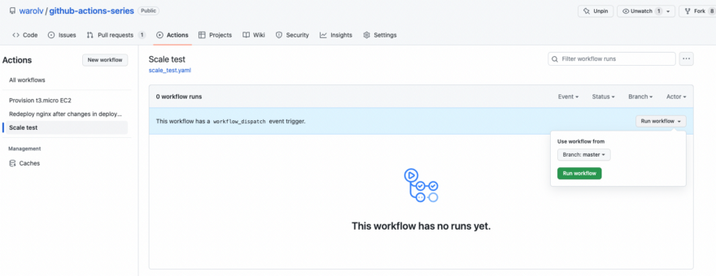

Click on 'Run workflow'

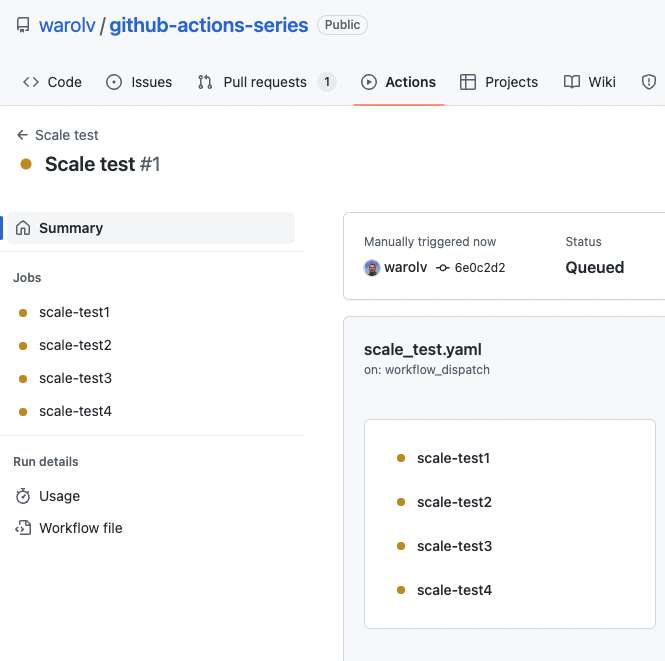


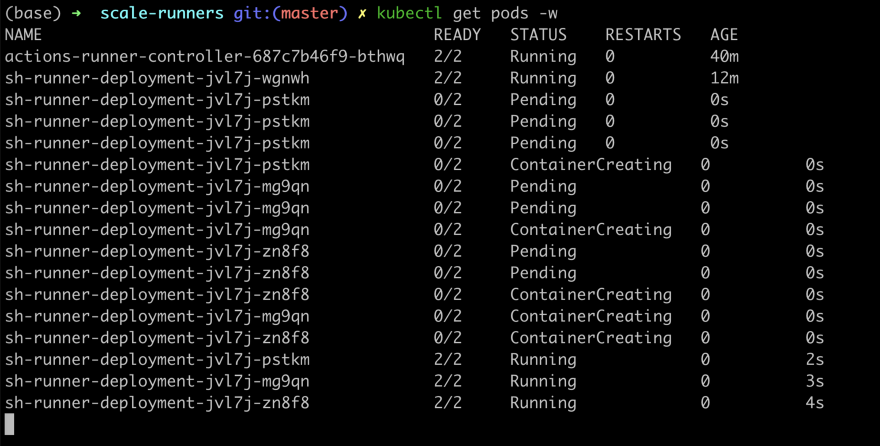


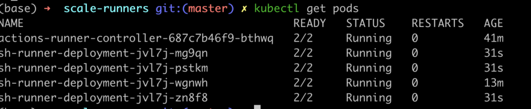


You can see after 1 min or even less scaling to 4 runners is occurred. :-)


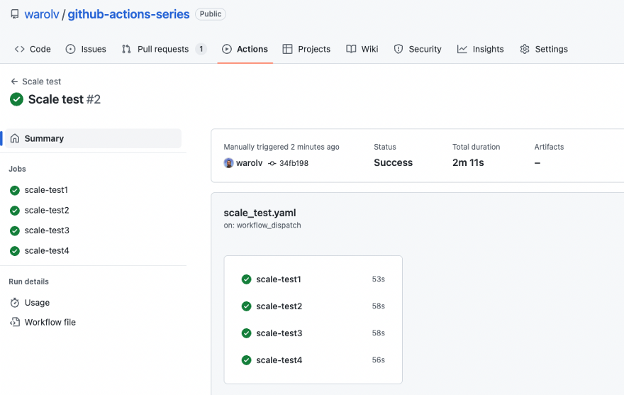

Took 2 min to complete, and scale down to 1 runner occurred after 10 min, the default settings.


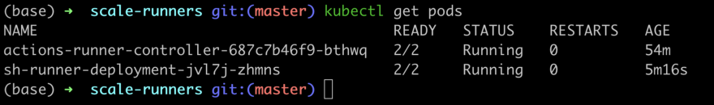


Thank you for reading, I hope you enjoyed it, see you in the next post.


In next post I will talk about **how to add/remove resources  to your k8s cluster dynamically using Karpenter.**

I also will create Youtube video for this tutorial on my YT channel: https://www.youtube.com/@igorzhivilo, please subscribe!

If you want to be notified when the next post of this tutorial is published, please follow me on [medium](https://warolv.medium.com/) and on my Twitter (@warolv).

You can get all tutorials of Gihub Action from my github repo by cloning it: ‘git clone https://github.com/warolv/github-actions-series.git‘
