# Use GitHub Actions and Terraform to provision EC2 instance

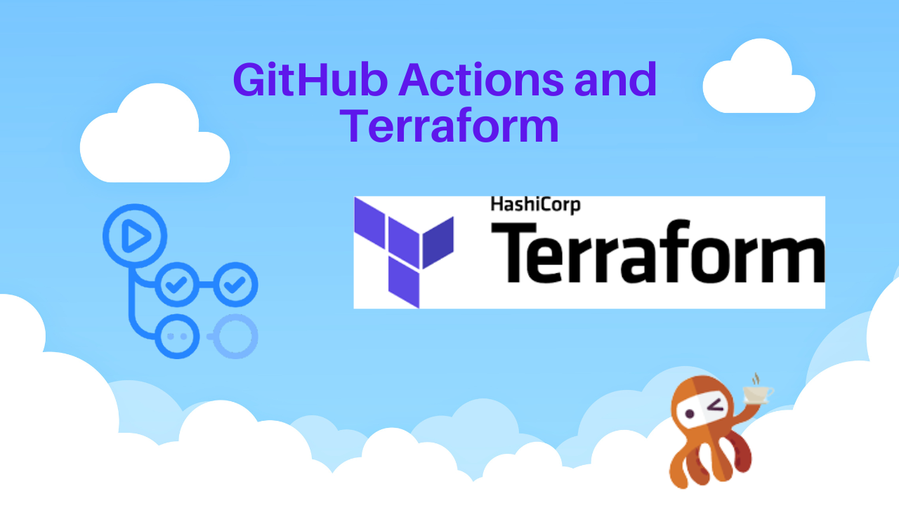

In this tutorial, I will create simple and practical example of how to provision EC2 instance with Github Actions and Terraform. I will use workflow_dispatch type of workflow which is triggered manually by user, using Terraform Github action from HashiCorp.

This tutorial, will be first in series of tutorials for Github Actions, in next tutorials I will show how to create and use self-hosted GitHub runners with EC2, docker containers running on Kubernetes and much more.

I will try to be practical as much as possible in my tutorials, so there will not be much theory.

### Github Actions published guides:

1. [Use GitHub Actions and Terraform to provision EC2 instance](tf-example.md)

2. [GitOps way with Github Actions and self-hosted runner on Kubernetes](gitops-selfhosted-runner.md)

3. [Automatic scaling with Github Actions and self-hosted runners](scale-runners.md)

4. [Github Actions with k8s and Karpenter to dynamically provision your runners on spot instances](gh-karpenter-spots.md)

5. [Github Actions with ChatOps to write beautiful python code](gh-chatops.md)

6. [OpenID Connect and Github Actions to authenticate with Amazon Web Services](gh-oidc.md)

## Goal

Deploy EC2 instance of t3.small size to your AWS account using Github Actions and Terraform.

I will use ‘workflow_dispatch’ event for this, which is manually triggered.

### workflow_dispatch

> This event occurs when someone triggers a workflow run on GitHub or sends a POST request to the "Create a workflow dispatch event" endpoint. For more information, see "Events that trigger workflows."

## Let’s do it

**Generate AWS Credentials for terraform user**

Go to your AWS account -> IAM -> Add new user

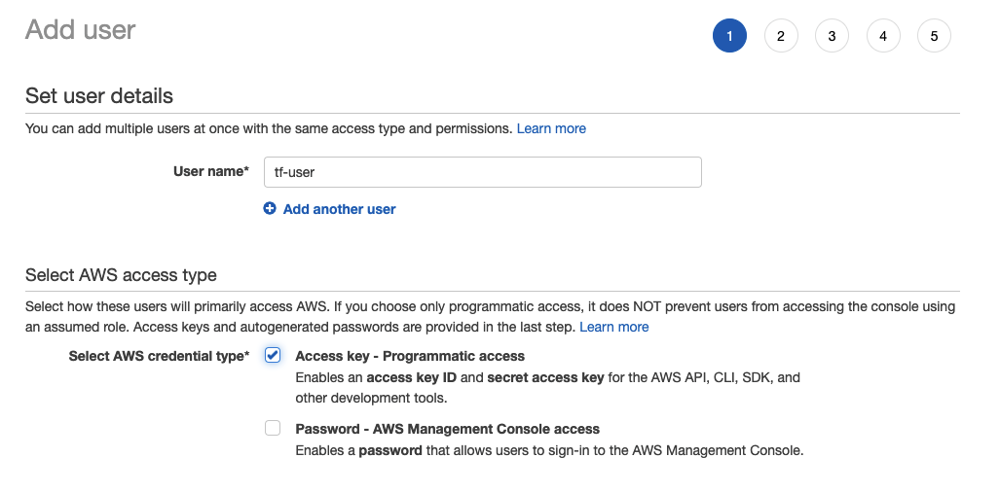

> We need only ‘Programmatic access’

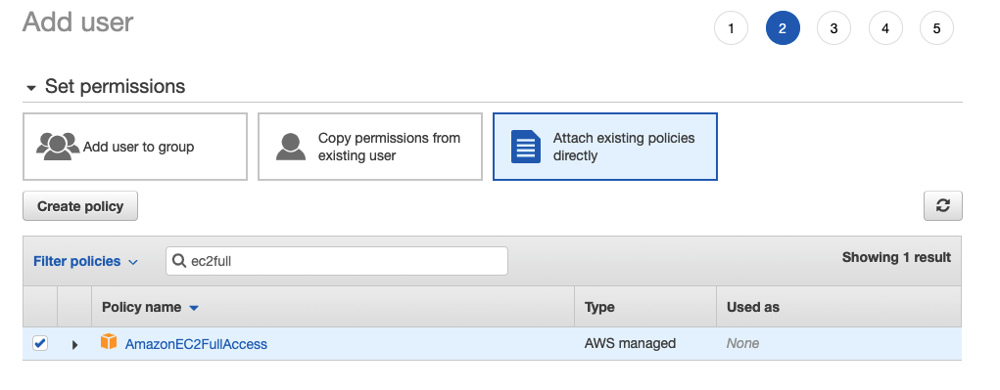

> To simplify this tutorial, I will use EC2 Full Access permissions.

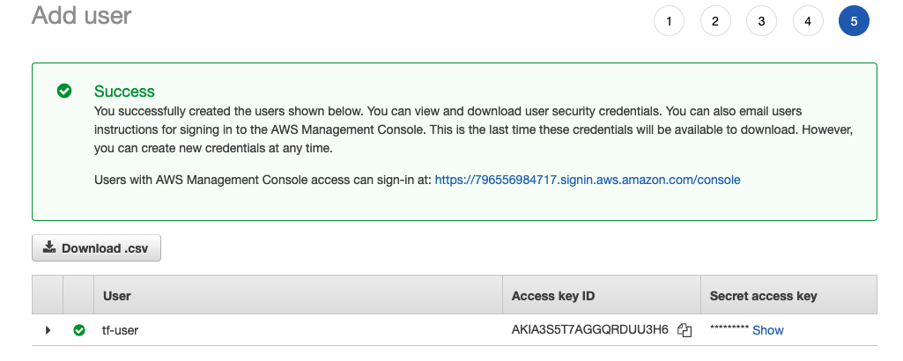

Download and save Access key id and Secret access key which will be added as secrets to github repo.

### Next step will be to add credentials to Github as secrets

Go to your github repository -> settings -> secrets -> actions

> My repo is https://github.com/warolv/github-actions-series, with all the code and the github actions workflow.

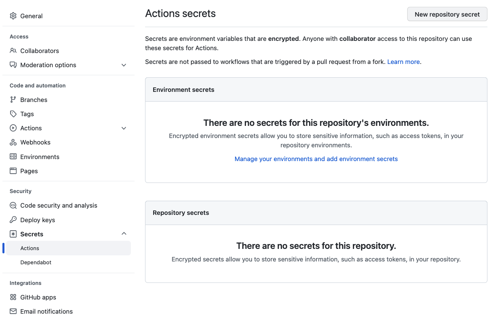

### Add new repository secret

Need to add two secrets: TF_USER_AWS_KEY (Access key id) and TF_USER_AWS_SECRET (Secret access key) which will be used later in worflow I build.

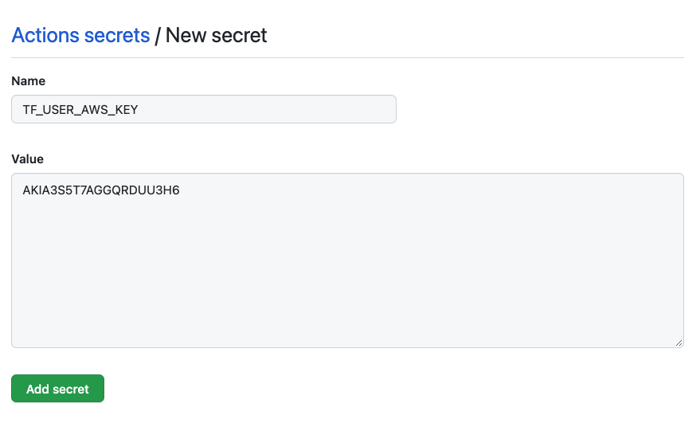

Add TF_USER_AWS_SECRET in the same way.

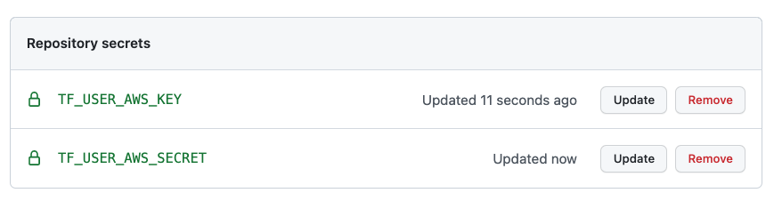


### Overview of terraform script to provision EC2 instance

* The provisioned instance based on ubuntu AMI.
* Instance type is t3.micro.
* Instance will be provisioned to default VPC | subnet | security group.
* Need to create SSH key pair to connect with provisioned instance.
* EC2 will be provisioned to ‘us-east-2’ region.

### Generate SSH key pair to connect with EC2 instance

AWS console -> EC2 -> Key Pair -> Create Key Pair


Download .pem file, it will be used later to connect with EC2 instance.

### Terraform script to provision EC2 instance (app_server)

https://github.com/warolv/github-actions-series/blob/master/tf-example/main.tf

main.tf

``` terraform
# use ubuntu 20 AMI for EC2 instance
data "aws_ami" "ubuntu" {
    most_recent = true
filter {
        name   = "name"
        values = ["ubuntu/images/hvm-ssd/*20.04-amd64-server-*"]
    }
filter {
        name   = "virtualization-type"
        values = ["hvm"]
    }
owners = ["099720109477"] # Canonical
}
# provision to us-east-2 region
provider "aws" {
  region  = "us-east-2"
}
resource "aws_instance" "app_server" {
  ami           = data.aws_ami.ubuntu.id
  instance_type = "t3.micro"
  key_name      = "app-ssh-key"
tags = {
    Name = var.ec2_name
  }
}
```

# variables.tf

The EC2 name will be set through workflow using the inputs.

``` terraform
variable "ec2_name" {
  type = string
}
```

## Create workflow with Github Actions to provision EC2 instance

* ‘configure-aws-credentials’ action used to set AWS credentials with docker container to be used by Terraform.

* You need to define name of EC2 instance using terraform variables: TF_VAR_ec2_name, before TF runs.

* Used setup-terraform action from HashiCorp.

* Used GitHub-hosted runner: ubuntu-latest.

https://github.com/warolv/github-actions-series/blob/master/.github/workflows/provision_ec2.yaml

To see your workflow in actions -> workflows, first need to create ‘.github/workflows/provision_ec2.yaml’ and add it to your repository.

 .github/workflows/provision_ec2.yaml


``` yaml
name: Provision t3.micro EC2
on:
  workflow_dispatch:
    inputs:
      ec2-name:
        description: EC2 name
        required: true
        default: 'App Server'
        type: string
jobs:
  provision-ec2:
    runs-on: ubuntu-latest
    steps:
      - uses: actions/checkout@v3
      - uses: actions/setup-node@v3
        with:
          node-version: '14'
      - name: Configure AWS credentials
        uses: aws-actions/configure-aws-credentials@v1
        with:
          aws-access-key-id: '${{ secrets.TF_USER_AWS_KEY }}'
          aws-secret-access-key: '${{ secrets.TF_USER_AWS_SECRET }}'
          aws-region: us-east-2
      - name: Setup Terraform
        uses: hashicorp/setup-terraform@v2
        with:
          terraform_wrapper: false
      - name: Terraform Apply
        id:   apply
        env:
          TF_VAR_ec2_name:  "${{ github.event.inputs.ec2-name }}"
        run: |
          cd tf-example/
          terraform init
          terraform validate
          terraform plan 
          terraform apply -auto-approve
```

I am using ‘workflow_dispatch’ type of workflow which is triggered manually.

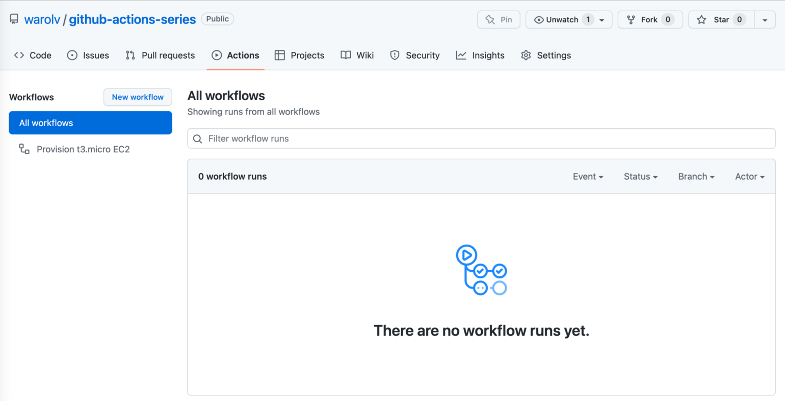

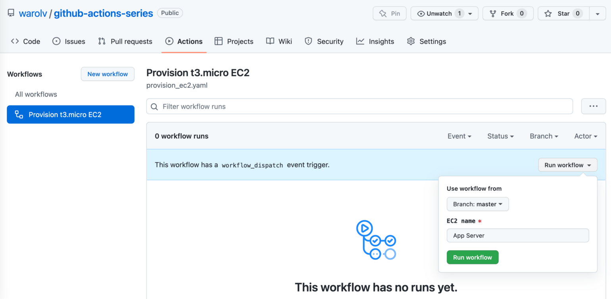

Click ‘Run workflow’

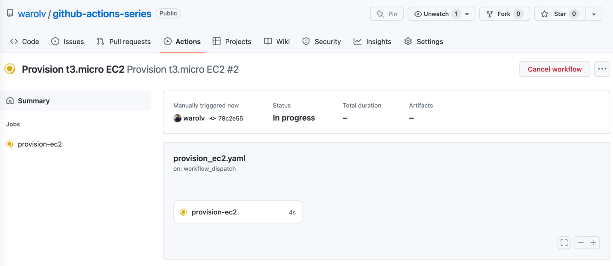

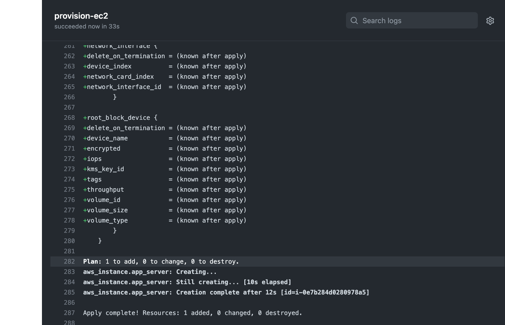

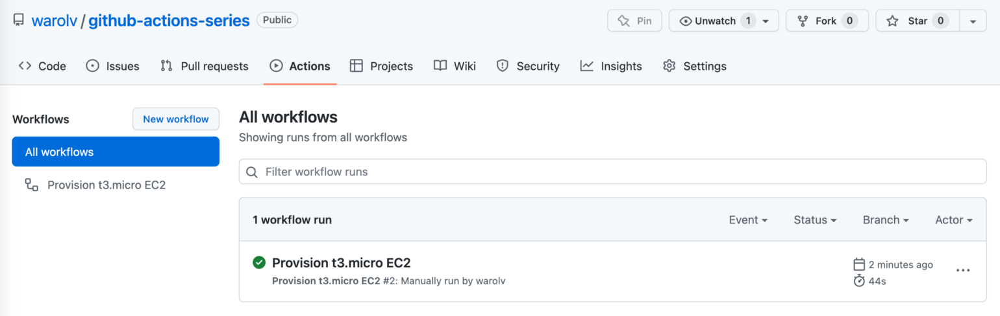

You can see using AWS console that EC2 instance created!

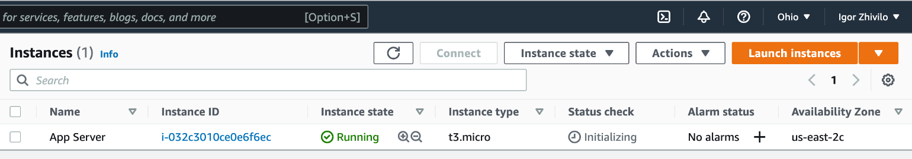

Now try to connect to this instance using ‘app-ssh-key’

I downloaded app-ssh-key.pem file in my mac to ~/Downloads folder

```
cp ~/Downloads/app-ssh-key.pem ~/.ssh
cd ~/.ssh
chmod 600 app-ssh-key.pem
ssh -i app-ssh-key.pem ubuntu@13.58.251.181
```

Success!


In this tutorial, I explained how to provision EC2 instance using Terraform and Github Actions workflow, I used GitHub-hosted runner and workflow_dispatch type of workflow which is triggered manually.

Thank you for reading, I hope you enjoyed it, see you in the next post.

If you want to be notified when the next post of this tutorial is published, please follow me on [medium](https://warolv.medium.com/) and on my Twitter (@warolv).

You can get all tutorials of Gihub Action from my github repo by cloning it: ‘git clone https://github.com/warolv/github-actions-series.git‘

